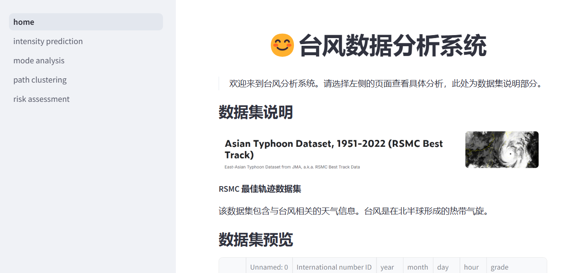
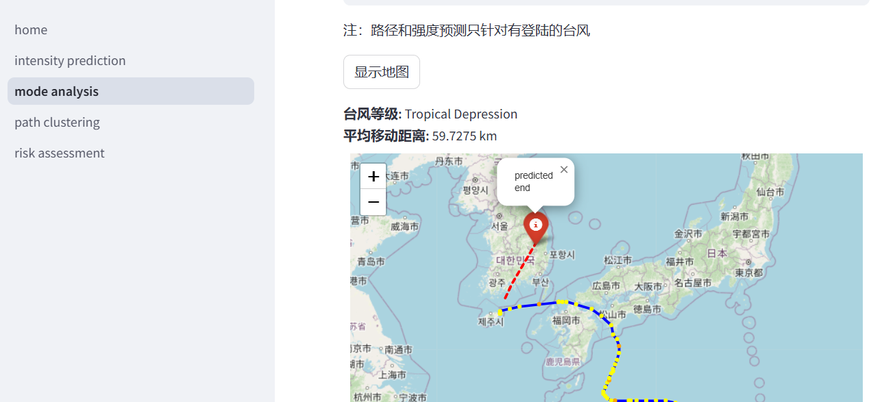

### 分布式课程设计
具体请见
https://sparktest-v8fad5jyo4bsp3at8mputd.streamlit.app/




=======
###### 数据说明:
```
1. International number ID
类型：整数
描述：台风的国际编号。前两位数字表示台风发生的年份，后两位是从 1 开始的递增整数索引。如果前导数字为零，则省略。例如，2004 年的第二个台风编号为 402；1960 年的第十个台风编号为 6010。
2. year
类型：整数
范围：1951 到 2022
描述：台风发生的年份。
3. month
类型：整数
范围：1 到 12
描述：台风发生的月份。
4. day
类型：整数
描述：台风发生的日期。
5. hour
类型：整数
范围：0 到 23
描述：台风发生的小时。
6. grade
类型：分类数据
描述：台风的等级。可能的选项包括：
'Tropical Depression'
'Tropical Cyclone of TS intensity or higher'
'Extra-tropical Cyclone'
'Just entering into the responsible area of RSMC Tokyo-Typhoon Center'
'Severe Tropical Storm'
'Tropical Storm'
'Typhoon'
7. Latitude of the center
类型：整数
描述：台风中心的纬度，缩放因子为 10。例如，如果实际纬度为 25.3，则保存为 253。
8. Longitude of the center
类型：整数
描述：台风中心的经度，缩放因子为 10。例如，如果实际经度为 135.7，则保存为 1357。
9. Central pressure
类型：整数
描述：台风中心的气压，单位为百帕（hPa）。中央气压是衡量台风强度的重要指标之一，通常气压越低，台风强度越强。
10. Maximum sustained wind speed
类型：整数
描述：台风中心附近的最大持续风速，单位为节（kt）。最大持续风速是衡量台风强度的另一个重要指标。
11. Direction of the longest radius of 50kt winds or greater
类型：字符串
描述：50节（kt）或更大风速的最长半径的方向。可能的方向包括北（N）、东北（NE）、东（E）、东南（SE）、南（S）、西南（SW）、西（W）和西北（NW）。
12. The longest radius of 50kt winds or greater
类型：整数
描述：50节（kt）或更大风速的最长半径，单位为海里（nm）。这是台风风场的一个重要指标，表示台风影响范围的大小。
13. The shortest radius of 50kt winds or greater
类型：整数
描述：50节（kt）或更大风速的最短半径，单位为海里（nm）。这是台风风场的另一个重要指标。
14. Direction of the longest radius of 30kt winds or greater
类型：字符串
描述：30节（kt）或更大风速的最长半径的方向。可能的方向包括北（N）、东北（NE）、东（E）、东南（SE）、南（S）、西南（SW）、西（W）和西北（NW）。
15. The longest radius of 30kt winds or greater
类型：整数
描述：30节（kt）或更大风速的最长半径，单位为海里（nm）。这是台风风场的一个重要指标，表示台风影响范围的大小。
16. The shortest radius of 30kt winds or greater
类型：整数
描述：30节（kt）或更大风速的最短半径，单位为海里（nm）。这是台风风场的另一个重要指标。
17. Indicator of landfall or passage
类型：字符串
描述：指示台风是否登陆或经过陆地。可能的值包括空格（' '）和井号（'#'）。井号（'#'）表示台风中心已经到达陆地。首次出现井号是在1991年。

6. Latest Revision
类型：日期
描述：数据的最新修订日期。
```


